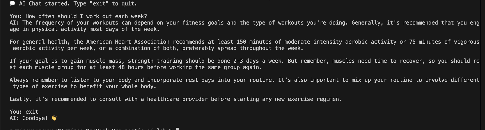

# NestJS AI Lab

An experimental NestJS project exploring AI-powered features (chat, CLI tools, and vector search with Pinecone).  
This repo is intended as a playground for building and testing AI integrations in a clean, modular NestJS architecture.

---

## Table of Contents

- [Features](#features)
- [Project Structure](#project-structure)
- [Getting Started](#getting-started)
  - [Prerequisites](#prerequisites)
  - [Installation](#installation)
  - [Running the App](#running-the-app)
  - [Running Tests](#running-tests)
- [Environment Configuration](#environment-configuration)
- [API Overview](#api-overview)
  - [AI Module](#ai-module)
  - [Pinecone Module](#pinecone-module)
- [CLI Usage](#cli-usage)
- [Development Guidelines](#development-guidelines)
- [Screenshots](#screenshots)
- [License](#license)

---

## Features

- **NestJS-based REST API**
  - Modular architecture (`ai`, `pinecone`, `cli`).
- **AI integration playground**
  - Central AI service & controller in the `ai` module.
- **Vector search with Pinecone**
  - Dedicated `pinecone` module for working with the Pinecone API.
- **CLI tooling**
  - `chat` CLI tool for interacting with the AI service from the terminal.
- **Testing setup**
  - Unit tests (`*.spec.ts`) and end-to-end tests under `test/`.

---

## Project Structure

Top-level layout (simplified from `project-structure.txt`):

```text
.
├── .env
├── .gitignore
├── .prettierrc
├── LICENSE
├── README.md
├── eslint.config.mjs
├── nest-cli.json
├── package.json
├── pnpm-lock.yaml
├── project-structure.txt
├── tsconfig.build.json
├── tsconfig.json
├── .vscode
│   ├── launch.json
│   └── settings.json
├── src
│   ├── ai
│   │   ├── ai.controller.spec.ts     # Unit tests for AI controller
│   │   ├── ai.controller.ts          # AI HTTP endpoints
│   │   ├── ai.module.ts              # AI NestJS module wiring
│   │   ├── ai.service.spec.ts        # Unit tests for AI service
│   │   └── ai.service.ts             # Core AI business logic
│   ├── app.controller.spec.ts        # App-level controller tests
│   ├── app.controller.ts             # Root controller
│   ├── app.module.ts                 # Root application module
│   ├── app.service.ts                # Root application service
│   ├── cli
│   │   └── chat.cli.ts               # Chat CLI entrypoint
│   ├── main.ts                       # NestJS bootstrap
│   └── pinecone
│       ├── pinecone.controller.spec.ts   # Tests for Pinecone controller
│       ├── pinecone.controller.ts        # Pinecone HTTP endpoints
│       ├── pinecone.module.ts            # Pinecone module wiring
│       ├── pinecone.service.spec.ts      # Tests for Pinecone service
│       └── pinecone.service.ts           # Pinecone business logic
└── test
    ├── app.e2e-spec.ts               # E2E tests
    └── jest-e2e.json                 # Jest E2E config
```

---

## Getting Started

### Prerequisites

- **Node.js** >= 18
- **pnpm** (recommended) or npm/yarn
- A **Pinecone** account and API key (if you use the Pinecone endpoints)
- Any external AI provider keys (OpenAI, etc.), depending on how `ai.service.ts` is implemented

### Installation

From the project root:

```bash
pnpm install
# or
npm install
```

### Running the App

#### Development

```bash
pnpm start:dev
# or
npm run start:dev
```

The app will typically be available at:

- API base URL: `http://localhost:3000`

#### Production build

```bash
pnpm build
pnpm start:prod

# or with npm
npm run build
npm run start:prod
```

### Running Tests

Unit tests:

```bash
pnpm test
# or
npm test
```

Watch mode:

```bash
pnpm test:watch
# or
npm run test:watch
```

End-to-end tests:

```bash
pnpm test:e2e
# or
npm run test:e2e
```

---

## Environment Configuration

Configuration is handled via the `.env` file in the project root.

Typical variables you might need (adjust to match your actual usage):

```env
# NestJS
PORT=3000

# AI provider (example)
OPENAI_API_KEY=your-openai-key

# Pinecone
PINECONE_API_KEY=your-pinecone-api-key
PINECONE_ENVIRONMENT=your-pinecone-env
PINECONE_INDEX=your-index-name
```

Do **not** commit real secrets to version control.  
Use `.env.example` (optional) to document required variables for collaborators.

---

## API Overview

### AI Module

Located in [`src/ai`](src/ai).

- [`src/ai/ai.module.ts`](src/ai/ai.module.ts) – declares the AI module and wires up:
  - [`src/ai/ai.service.ts`](src/ai/ai.service.ts) – core AI logic (calling an LLM, handling prompts, etc.)
  - [`src/ai/ai.controller.ts`](src/ai/ai.controller.ts) – exposes HTTP endpoints for AI operations
- Corresponding tests:
  - [`src/ai/ai.controller.spec.ts`](src/ai/ai.controller.spec.ts)
  - [`src/ai/ai.service.spec.ts`](src/ai/ai.service.spec.ts)

Typical patterns you might expose:

- `POST /ai/chat` – send a message and receive an AI-generated response
- `POST /ai/complete` – text completion
- `POST /ai/embeddings` – generate embeddings (possibly reused by Pinecone)

> Check `ai.controller.ts` for the actual route paths and payload shape.

### Pinecone Module

Located in [`src/pinecone`](src/pinecone).

- [`src/pinecone/pinecone.module.ts`](src/pinecone/pinecone.module.ts) – encapsulates Pinecone-related providers
- [`src/pinecone/pinecone.service.ts`](src/pinecone/pinecone.service.ts) – handles:
  - Index initialization
  - Upserts / queries over embeddings
- [`src/pinecone/pinecone.controller.ts`](src/pinecone/pinecone.controller.ts) – HTTP endpoints to interact with indexes:
  - `POST /pinecone/upsert` – store vectors
  - `POST /pinecone/query` – perform similarity search

Tests:

- [`src/pinecone/pinecone.controller.spec.ts`](src/pinecone/pinecone.controller.spec.ts)
- [`src/pinecone/pinecone.service.spec.ts`](src/pinecone/pinecone.service.spec.ts)

---

## CLI Usage

The CLI entrypoint is [`src/cli/chat.cli.ts`](src/cli/chat.cli.ts).  
It is intended for terminal-based interaction with the AI service (e.g., chat, quick experiments).

A common setup is to add an npm script in [package.json](package.json):

```jsonc
{
  "scripts": {
    "start:chat": "ts-node src/cli/chat.cli.ts",
  },
}
```

Then you can run:

```bash
pnpm run start:chat
# or
npm run start:chat
```

Example flows you might support (depending on implementation):

- Start an interactive chat session in the terminal
- Send a one-off prompt and print the response
- Pipe files or standard input into the AI model

---

## Development Guidelines

- **Code style**
  - Enforced via [eslint.config.mjs](eslint.config.mjs) and [.prettierrc](.prettierrc).
- **Module structure**
  - Keep new functionality in dedicated modules (e.g. `src/my-feature`).
  - Each module should have its own `*.module.ts`, `*.controller.ts`, `*.service.ts`, and tests.
- **Testing**
  - For new features, add:
    - Unit tests in `*.spec.ts`
    - E2E tests under [test](test)
- **VS Code**
  - `.vscode/launch.json` and `.vscode/settings.json` are preconfigured for debugging and consistent formatting.

---

## Screenshots

1. **CLI Chat Session**
   - File: `docs/screenshot-cli-chat.png`
   - Description: Terminal screenshot of `pnpm run start:chat` with a short conversation.

   

---

## License

This project is licensed under the terms described in [LICENSE](LICENSE).
