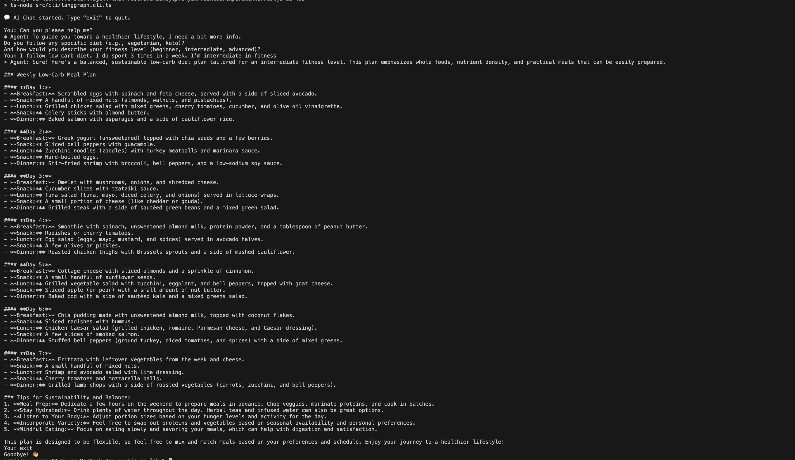

# NestJS AI Lab

An experimental NestJS project exploring AI-powered features:

- REST API (AI, Pinecone)
- CLI tools
- Multi-node AI agents with LangGraph

This repository is a playground for experimenting with AI integrations and
evaluating architectural patterns within a modular NestJS codebase.

## Architecture Status (Experimental)

This project is an experimental AI lab. The current architecture is **not final**
and is optimized for rapid exploration of AI integrations, vector search, and
agent-based workflows.

Expect refactors and breaking changes as ideas are tested and refined.
Documentation will evolve alongside the codebase.

---

## Table of Contents

- [Features](#features)
- [Project Structure](#project-structure)
- [Getting Started](#getting-started)
  - [Prerequisites](#prerequisites)
  - [Installation](#installation)
  - [Running the App](#running-the-app)
  - [Running Tests](#running-tests)
- [Environment Configuration](#environment-configuration)
- [API Overview](#api-overview)
  - [AI Module](#ai-module)
  - [Pinecone Module](#pinecone-module)
  - [LangGraph Module](#langgraph-module)
- [CLI Usage](#cli-usage)
  - [Chat CLI](#chat-cli)
  - [LangGraph Agent CLI](#langgraph-agent-cli)
- [Troubleshooting](#troubleshooting)
- [Development Guidelines](#development-guidelines)
- [Screenshots](#screenshots)
- [License](#license)

---

## Features

- **NestJS-based**
  - Modular architecture (`ai`, `pinecone`, `cli`, `langgraph`).
- **AI integration playground**
  - Central AI service & controller in the `ai` module.
- **Vector search with Pinecone**
  - Dedicated `pinecone` module for working with the Pinecone API.
- **LangGraph multi-node agents**
  - Agent graphs (plan → retrieve → act → reflect), tool calls, and stateful interactions.
- **CLI tooling**
  - Classic chat CLI and a LangGraph agent CLI for interactive terminal sessions.
- **Testing setup**
  - Unit tests (`*.spec.ts`) and end-to-end tests under `test/`.

---

## Project Structure

```text
.
├── .env
├── .env.example
├── .gitignore
├── .prettierrc
├── .vscode
│   ├── launch.json
│   └── settings.json
├── LICENSE
├── README.md
├── docs
│   ├── screenshot-cli-chat.png
│   └── screenshot-multinode-agent-chat.png
├── eslint.config.mjs
├── experiements.ts
├── nest-cli.json
├── package.json
├── pnpm-lock.yaml
├── src
│   ├── ai
│   │   ├── ai.controller.spec.ts
│   │   ├── ai.controller.ts
│   │   ├── ai.module.ts
│   │   ├── ai.service.spec.ts
│   │   └── ai.service.ts
│   ├── app.controller.spec.ts
│   ├── app.controller.ts
│   ├── app.module.ts
│   ├── app.service.ts
│   ├── cli
│   │   ├── chat.cli.ts
│   │   └──  langgraph.cli.ts
│   ├── langgraph
│   │   ├── agent
│   │   │   ├── health-coach-agent.graph.ts
│   │   │   ├── health-coach-agent.nodes.ts
│   │   │   ├── health-coach-agent.state.ts
│   │   │   └── health-coach-agent.types.ts
│   │   ├── helpers
│   │   │   └── create-readline.ts
│   │   ├── langgraph.module.ts
│   │   ├── langgraph.service.spec.ts
│   │   ├── langgraph.service.ts
│   │   ├── memory
│   │   └── tools
│   ├── main.ts
│   └── pinecone
│       ├── pinecone.controller.spec.ts
│       ├── pinecone.controller.ts
│       ├── pinecone.module.ts
│       ├── pinecone.service.spec.ts
│       └── pinecone.service.ts
├── test
│   ├── app.e2e-spec.ts
│   └── jest-e2e.json
├── tsconfig.build.json
└── tsconfig.json
```

Key files:

- CLI
  - [src/cli/chat.cli.ts](src/cli/chat.cli.ts)
  - [src/cli/langgraph.cli.ts](src/cli/langgraph.cli.ts)
- LangGraph
  - [src/langgraph/langgraph.service.ts](src/langgraph/langgraph.service.ts)
  - [src/langgraph/helpers/create-readline.ts](src/langgraph/helpers/create-readline.ts)
  - [src/langgraph/agent/health-coach-agent.nodes.ts](src/langgraph/agent/health-coach-agent.nodes.ts)
- API
  - [src/ai/ai.module.ts](src/ai/ai.module.ts)
  - [src/ai/ai.service.ts](src/ai/ai.service.ts)
  - [src/ai/ai.controller.ts](src/ai/ai.controller.ts)
  - [src/pinecone/pinecone.module.ts](src/pinecone/pinecone.module.ts)
  - [src/pinecone/pinecone.service.ts](src/pinecone/pinecone.service.ts)
  - [src/pinecone/pinecone.controller.ts](src/pinecone/pinecone.controller.ts)

---

## Getting Started

### Prerequisites

- Node.js >= 18
- **pnpm** (recommended) or npm/yarn
- A **Pinecone** account and API key (if you use Pinecone endpoints)
- External AI provider keys (e.g. OpenAI), depending on how [src/ai/ai.service.ts](src/ai/ai.service.ts) is implemented

### Installation

From the project root:

```bash
pnpm install
# or
npm install
```

### Running the App

#### Development

```bash
pnpm start:dev
# or
npm run start:dev
```

App URL:

- http://localhost:3000

#### Production build

```bash
pnpm build
pnpm start:prod

# or with npm
npm run build
npm run start:prod
```

### Running Tests

Unit tests:

```bash
pnpm test
# or
npm test
```

Watch mode:

```bash
pnpm test:watch
# or
npm run test:watch
```

End-to-end tests:

```bash
pnpm test:e2e
# or
npm run test:e2e
```

---

## Environment Configuration

Configuration is handled via the `.env` file in the project root.

Typical variables:

```env
# NestJS
PORT=3000

# AI provider (example)
OPENAI_API_KEY=your-openai-key

# Pinecone
PINECONE_API_KEY=your-pinecone-api-key
PINECONE_INDEX=your-index-name

TAVILY_API_KEY=tvly-dev-**********

# LangGraph (optional)
LANGGRAPH_ENABLED=true
LANGGRAPH_NAMESPACE=default
```

---

## API Overview

### AI Module

Located in [src/ai](src/ai).

- [src/ai/ai.module.ts](src/ai/ai.module.ts) – declares the AI module and wires up:
  - [src/ai/ai.service.ts](src/ai/ai.service.ts) – core AI logic (LLM calls, prompts, tools)
  - [src/ai/ai.controller.ts](src/ai/ai.controller.ts) – HTTP endpoints for AI operations
- Tests:
  - [src/ai/ai.controller.spec.ts](src/ai/ai.controller.spec.ts)
  - [src/ai/ai.service.spec.ts](src/ai/ai.service.spec.ts)

Common endpoints:

- POST /ai/chat – send a message and receive an AI-generated response
- POST /ai/complete – text completion
- POST /ai/embeddings – generate embeddings (can be reused by Pinecone)

### Pinecone Module

Located in [src/pinecone](src/pinecone).

- [src/pinecone/pinecone.module.ts](src/pinecone/pinecone.module.ts) – encapsulates Pinecone providers
- [src/pinecone/pinecone.service.ts](src/pinecone/pinecone.service.ts) – index init, upserts, queries
- [src/pinecone/pinecone.controller.ts](src/pinecone/pinecone.controller.ts) – HTTP endpoints:
  - POST /pinecone/upsert – store vectors
  - POST /pinecone/query – similarity search

Tests:

- [src/pinecone/pinecone.controller.spec.ts](src/pinecone/pinecone.controller.spec.ts)
- [src/pinecone/pinecone.service.spec.ts](src/pinecone/pinecone.service.spec.ts)

### LangGraph Module

Located in [src/langgraph](src/langgraph).

- [src/langgraph/langgraph.service.ts](src/langgraph/langgraph.service.ts) – orchestrates agent graph execution and exposes:
  - `LangGraphService.ask(message: string)` – run the agent on a user prompt
  - `LangGraphService.askQuestion(rl, prompt?)` – helper to read from a provided readline
- [src/langgraph/agent/health-coach-agent.nodes.ts](src/langgraph/agent/health-coach-agent.nodes.ts) – agent nodes (plan/retrieve/act/reflect)
- [src/langgraph/helpers/create-readline.ts](src/langgraph/helpers/create-readline.ts) – single shared readline instance for CLI

If you expose HTTP around the graph, keep it in a dedicated controller/module under `src/langgraph` (not required for CLI usage).

---

## CLI Usage

### Chat CLI

Classic chat against the AI service:

- Entrypoint: [src/cli/chat.cli.ts](src/cli/chat.cli.ts)

Add scripts in [package.json](package.json):

```jsonc
{
  "scripts": {
    "start:chat": "ts-node src/cli/chat.cli.ts",
  },
}
```

Run:

```bash
pnpm run start:chat
# or
npm run start:chat
```

### LangGraph Agent CLI

Interactive session with the multi-node agent:

- Entrypoint: [src/cli/langgraph.cli.ts](src/cli/langgraph.cli.ts)
- Uses a single shared readline from [src/langgraph/helpers/create-readline.ts](src/langgraph/helpers/create-readline.ts)
- Reads input via `LangGraphService.askQuestion(...)` and runs the agent via `LangGraphService.ask(...)` from [src/langgraph/langgraph.service.ts](src/langgraph/langgraph.service.ts)

Add scripts in [package.json](package.json):

```jsonc
{
  "scripts": {
    "start:agent-chat": "ts-node src/cli/langgraph.cli.ts",
  },
}
```

Run:

```bash
pnpm run start:agent-chat
# or
npm run start:agent-chat
```

Behavior:

- Type your prompt and press Enter
- Type `exit` or `quit` to end the session

---

## Troubleshooting

- Duplicated characters in terminal:
  - Ensure there is only one readline listener.
  - The CLI uses the shared `rl` from [src/langgraph/helpers/create-readline.ts](src/langgraph/helpers/create-readline.ts).
  - Call `LangGraphService.askQuestion(rl)` (from [src/langgraph/langgraph.service.ts](src/langgraph/langgraph.service.ts)) or read via `rl.question` in the CLI, but do not create additional readline instances elsewhere.

---

## Development Guidelines

- Code style
  - Enforced via [eslint.config.mjs](eslint.config.mjs) and [.prettierrc](.prettierrc).
- Module structure
  - Keep new functionality in dedicated modules (e.g., `src/langgraph` for graphs/executors).
  - Each module should have its own `*.module.ts`, `*.controller.ts`, `*.service.ts`, and tests.
- Testing
  - For new features, add:
    - Unit tests in `*.spec.ts`
    - E2E tests under [test](test)
- VS Code
  - `.vscode/launch.json` and `.vscode/settings.json` are configured for debugging and formatting.

---

## Screenshots

1. CLI Chat Session
   - File: `docs/screenshot-cli-chat.png`
   - Description: Terminal screenshot of `pnpm run start:agent-chat` with a short conversation.

   

2. Multi-Agent CLI Chat Session
   - File: `docs/screenshot-multinode-agent-chat.png`
   - Description: Terminal screenshot of `pnpm run start:agent-chat` showing a multi-node conversation powered by LangGraph.

   

---

## License

This project is licensed under the terms described in [LICENSE](LICENSE).
